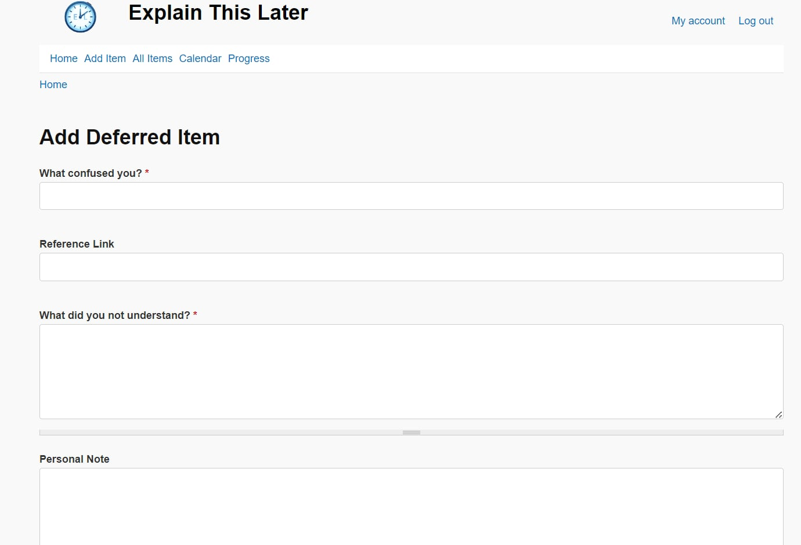
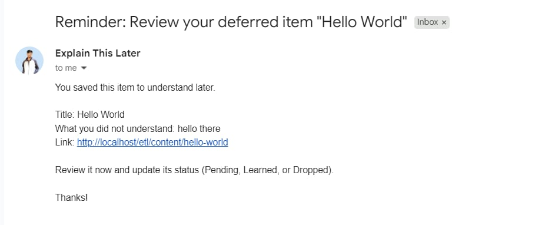
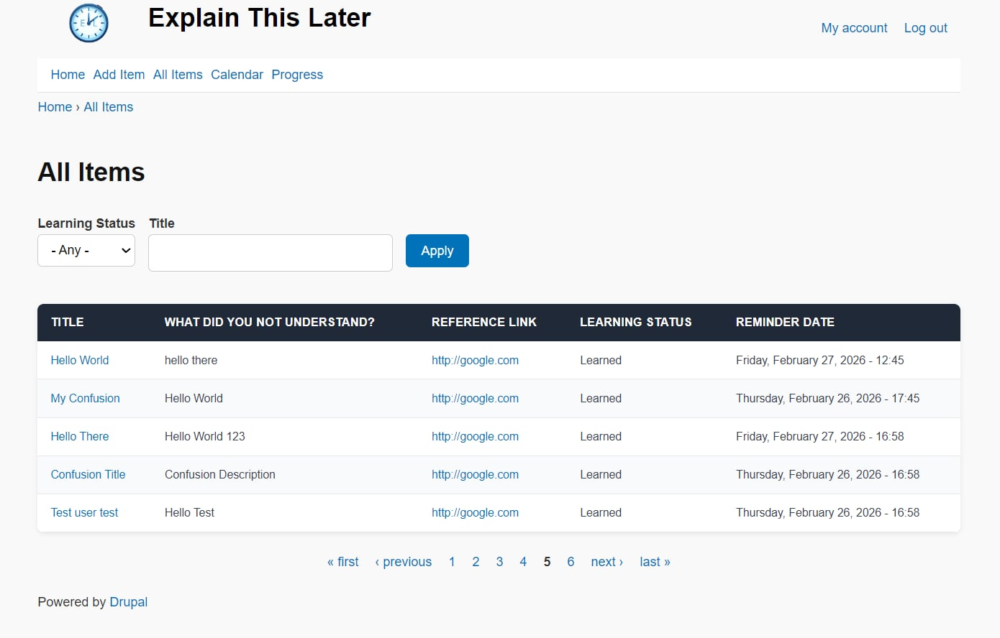
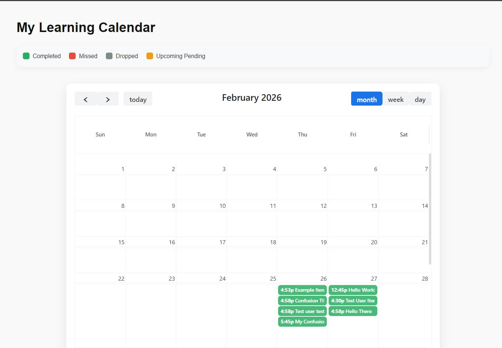
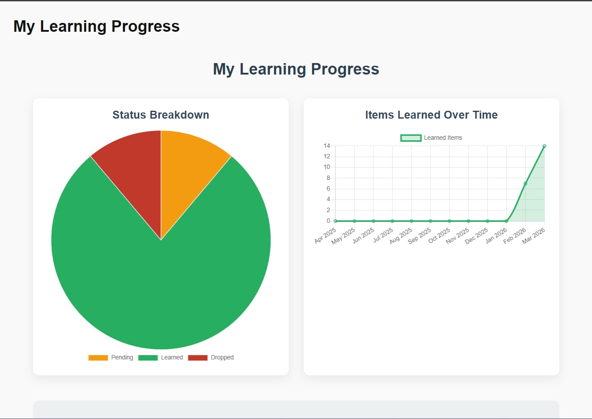
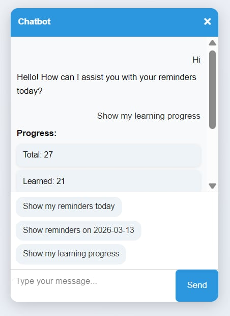
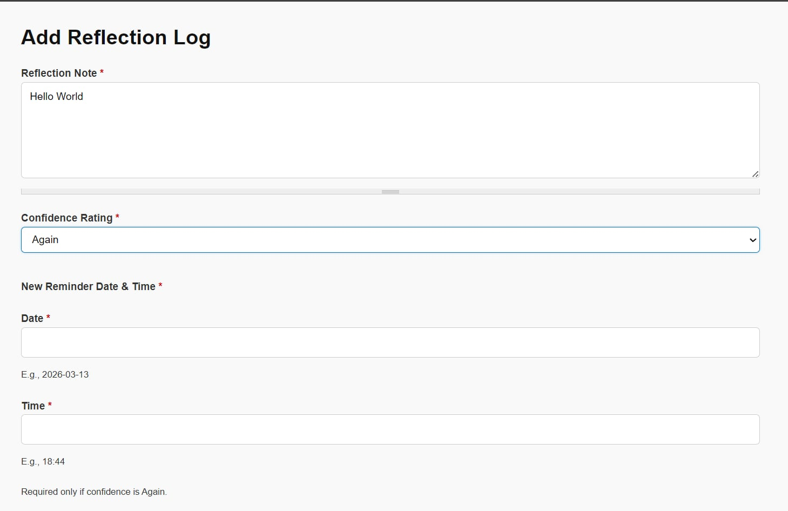

# Explain This Later - User Guide

This guide explains how to use the **Explain This Later** application.

## Table of Contents

1. [Introduction](#1-introduction)
2. [Creating an Account](#2-creating-an-account)
3. [Logging In](#3-logging-in)
4. [Adding a Deferred Item](#4-adding-a-deferred-item)
5. [Receiving Reminder Emails](#5-receiving-reminder-emails)
6. [Viewing and Managing Your Items](#6-viewing-and-managing-your-items)
7. [Using the Calendar View](#7-using-the-calendar-view)
8. [Tracking Your Learning Progress](#8-tracking-your-learning-progress)
9. [Using the Chatbot Assistant](#9-using-the-chatbot-assistant)
10. [Reviewing Concepts and Adding Reflection Logs](#10-reviewing-concepts-and-adding-reflection-logs)

## 1. Introduction

**Explain This Later** helps you manage concepts that you did not fully understand when you first encountered them.

Instead of forgetting them, you can:

- Save the concept for later review
- Schedule a reminder
- Reflect on what you learned
- Track your learning progress over time

The platform organizes your learning process and ensures you revisit important topics at the right time.

## 2. Creating an Account

To start using the platform, you need to create an account.

### Registration Steps

1. Open the **Register** page.
2. Enter the following information:
   - Username
   - Email address
3. Submit the registration form.

After submitting the form:

- A verification email will be sent to your email address.
- The email contains a **password setup link**.

### Setting Your Password

1. Click the link in the email.
2. Set your password.
3. Once the password is set successfully, you will be automatically redirected to the homepage.

Your account is now ready to use.

## 3. Logging In

If you already have an account:

1. Go to the **Login** page.
2. Enter:
   - Your **Username**
   - Your **Password**
3. Click **Log In**.

After logging in, you will be redirected to the homepage.

## 4. Adding a Deferred Item

A **Deferred Item** represents a concept, article, or idea that you want to revisit later.

### Steps to Add a Deferred Item

1. Click **“Add Deferred Item”** in the top navigation menu.
2. Fill in the required information:

| Field                        | Description                                                                                   | Required? |
|------------------------------|-----------------------------------------------------------------------------------------------|-----------|
| Title                        | Name of the concept or topic you did not understand                                          | Yes       |
| Reference Link (URL)         | Link to the resource (article, video, documentation, etc.)                                   | No        |
| What Did You Not Understand  | Detailed explanation of which part of the concept was confusing                              | Yes       |
| Personal Note                | Additional personal notes or thoughts to help remember context later                         | No        |
| Reminder Date & Time         | The date and time when you want to revisit and review the concept                            | Yes       |
| Learning Status              | Current learning state (automatically set to **Pending** at creation)                        | —         |
| Supporting Document          | Upload a related image or PDF (max 5 MB)                                                     | No        |

3. Submit the form.

Once saved, the item will be stored with **Pending** status and a reminder will be scheduled.

<!-- Screenshot: Adding a Deferred Item -->

## 5. Receiving Reminder Emails

At the scheduled reminder date and time, the system automatically sends you an email containing:

- The title of the Deferred Item
- What you did not understand
- A direct link to the item on the platform

You can click the link to revisit the concept.

<!-- Screenshot: Reminder Email -->

## 6. Viewing and Managing Your Items

View all your saved items via the **All Items** menu in the top navigation bar.

### Available Features

- Search items by title
- Filter items by learning status

### Learning Status Options

| Status   | Meaning                                          |
|----------|--------------------------------------------------|
| Pending  | Item is waiting to be reviewed                   |
| Learned  | You have successfully understood the concept     |
| Dropped  | You decided not to continue learning the item    |

<!-- Screenshot: All Items page -->

## 7. Using the Calendar View

The **Calendar View** helps you visualize your learning schedule. Access it from the **Calendar** menu.

### Features

The calendar displays:

- Upcoming reminders
- Missed reminders
- Completed items
- Dropped items

### Calendar Modes

- Daily View
- Weekly View
- Monthly View

Click any item in the calendar to go to its **Deferred Item** detail page.

<!-- Screenshot: Calendar View -->

## 8. Tracking Your Learning Progress

The **Progress** page gives a visual overview of your learning activity. Access it from the **Progress** menu.

### Analytics Available

1. **Status Distribution**  
   Pie chart showing counts of: Pending / Learned / Dropped

2. **Learning Timeline**  
   Chart showing how many items you have learned over time

3. **Completion Rate**  
   `Completion Rate = Learned Items / Total Items`

<!-- Screenshot: Progress Dashboard -->

## 9. Using the Chatbot Assistant

A floating chatbot icon appears on all pages when logged in.

### Opening the Chatbot

1. Click the chat icon
2. The chat interface appears

### Example Questions You Can Ask

- Show my reminders today
- Show reminders on 2025-12-15
- Show upcoming reminders
- Show my learning progress

The chatbot responds with reminder lists, progress summaries, etc.

<!-- Screenshot: Chatbot Interface -->

## 10. Reviewing Concepts and Adding Reflection Logs

When viewing a **Deferred Item**, you can update its learning status:

- **Mark as Learned** — when you successfully understand it
- **Mark as Dropped** — if you decide not to continue

### Adding a Reflection Log (for Learned items)

You can record:

- Your learning experience
- Confidence level
- Whether you need another reminder

### Confidence Rating

| Rating     | Meaning                              |
|------------|--------------------------------------|
| Again      | Still difficult — want another reminder |
| Hard       | Understand partially                 |
| Good       | Understand reasonably well           |
| Easy       | Concept is clear                     |
| Very Easy  | Fully understood                     |

If you select **Again**, you will be asked to set a new reminder date/time.

<!-- Screenshot: Reflection Log Form -->

## Summary

With **Explain This Later** you can:

- Save confusing concepts for later
- Receive scheduled reminders
- Track learning progress visually
- Manage your learning backlog
- Reflect meaningfully on what you learned
- Quickly retrieve information using the chatbot

The platform is designed to help you build a consistent habit of revisiting and mastering difficult concepts.